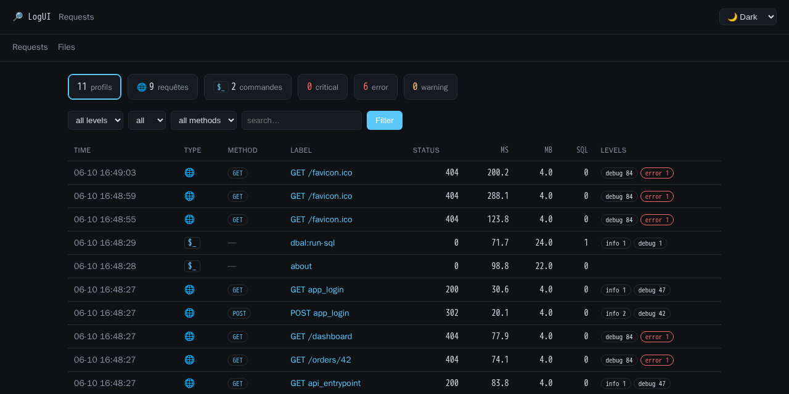
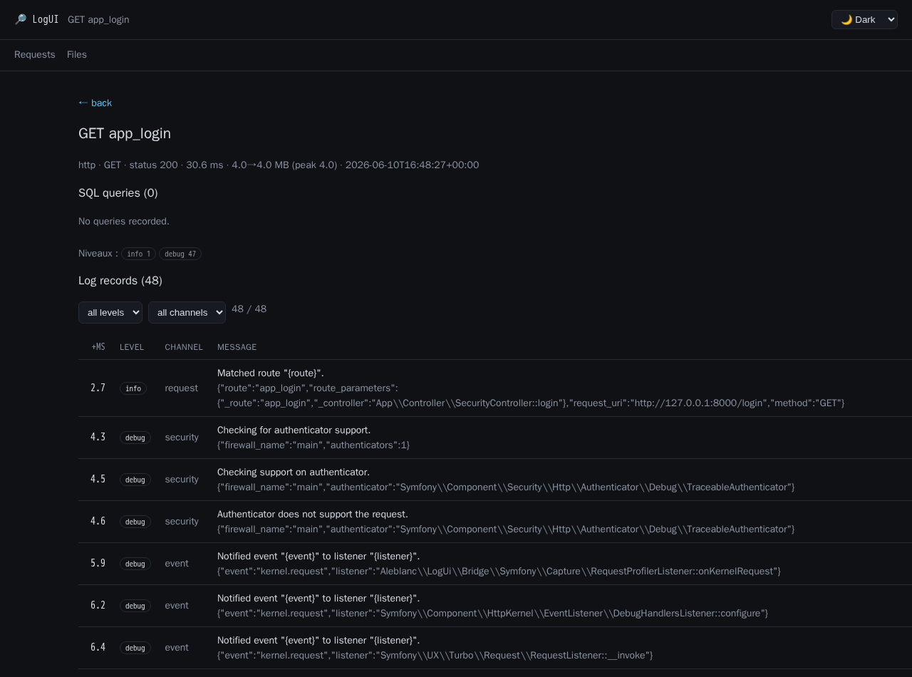

# 🔎 LogUI

> **Log viewer & lightweight profiler for Symfony.** It plugs into your existing logs — no separate store, no database, no build step. MIT licensed.

LogUI is an embeddable Composer package (in the spirit of Laravel Telescope / the Symfony Profiler)
that adds a small **web UI** to your app to browse requests, console commands and raw log files.

For every HTTP request and console command it captures pragmatic **stats** (duration, RAM
start→end→peak, SQL query count, log-level counts) plus the request's own log records, and writes it
all as **one line into your existing log file** (a `LOGUI@{json}` entry). The UI reads those lines
back. It also reads your **raw `.log` files** directly (Monolog, nginx access/error, …).

**No separate store. No new database. No front-end build.**


*Request list: clickable stats, HTTP + console profiles, method / level / SQL columns, themes.*


*Request detail: timing, RAM start→peak, SQL count, and the request's own log records (filterable by level & channel).*

## Features

- Auto-capture: **HTTP requests**, **console commands**, **Monolog records** (level counts + the request's records), **uncaught exceptions**, **SQL queries** (count + slow, when `doctrine/dbal` is present).
- Pure-PHP stats (`memory_get_usage`/`peak` + a Doctrine middleware) — **no PHP extension required**.
- **Telemetry written into your existing logs** (`LOGUI@` sentinel), read back by the UI — no separate store. Reads are **tail-bounded** (multi-GB logs are fine).
- **Request detail** shows that request's log records (all channels, even ones your file handlers drop), filterable by level/channel.
- **Raw `.log` viewer** (Files tab): multi-format parser + auto-discovery of Monolog handler files + a scan of your log directories.
- **Dashboard UI**: clickable stats (general counts), method column, filters (level/type/method/search), pagination (100/page), and **dark / light / sepia** themes.
- **Security**: open in `dev`/`test`; in production it is **fail-closed** (password, or delegated to your firewall). Sensitive context keys are **redacted** before writing.

## Requirements

- PHP **8.2+**
- Symfony **6.4 / 7.x / 8.x** (HttpKernel, Console, HttpFoundation, Config, DependencyInjection, Routing, EventDispatcher)
- Monolog **3**
- *(optional)* `doctrine/dbal` ^3.7|^4.0 — enables SQL query counting

## Install (Symfony)

LogUI ships a Flex recipe, so the quickest install is to point your app at this repo as a custom
recipe endpoint and require the package — the bundle, route and config are wired automatically, and
a random `LOGUI_PASSWORD` is generated into `.env` (override it in `.env.local` for production).

**1. Add the recipe endpoint** to your app's `composer.json`:

```json
{
    "extra": {
        "symfony": {
            "allow-contrib": true,
            "endpoint": [
                "https://raw.githubusercontent.com/aleblanc/logui/main/index.json",
                "flex://defaults"
            ]
        }
    }
}
```

**2. Require the package** — the recipe runs on install:

```bash
composer require aleblanc/logui:^0.1
```

This auto-registers the bundle, creates `config/routes/log_ui.yaml` + `config/packages/log_ui.yaml`,
and writes a generated `LOGUI_PASSWORD` to `.env` (a default, like `APP_SECRET`; for production put a
real secret in `.env.local`, which isn't committed).

**Monolog capture is automatic** — the bundle wires its handler onto every channel for you (no
`monolog.yaml` edit). Disable it with `log_ui.capture_monolog: false` (e.g. in production); see
[Configuration](#configuration).

**Open the UI at `/_logui`** — the default path (configurable via `log_ui.ui_path`). It's open in
`dev`/`test`; in `prod` it's fail-closed behind `LOGUI_PASSWORD` (or delegate to your firewall, see
[Access control](#access-control-in-production)).

> **Without the recipe** (or before tagging a release), do it by hand: add
> `Aleblanc\LogUi\Bridge\Symfony\LogUiBundle::class => ['all' => true]` to `config/bundles.php`,
> create `config/routes/log_ui.yaml` with `resource: '@LogUiBundle/config/routes.php'`, and set
> `LOGUI_PASSWORD` yourself. The bundle's config alias is **`log_ui`**. Monolog capture is still
> automatic. Recipe details & the `symfony/recipes-contrib` path: [`recipes/README.md`](recipes/README.md).

## Configuration

All keys are optional with sensible defaults (`config/packages/log_ui.yaml`):

```yaml
log_ui:
    telemetry_file: '%kernel.logs_dir%/%kernel.environment%.log'  # existing log to write/read telemetry
    slow_query_ms: 50                  # SQL slower than this is flagged
    max_records_per_profile: 1000      # cap on records captured per request (bounds line size)
    ui_path: /_logui
    access: password                   # password (default) | delegate
    ui_password: '%env(LOGUI_PASSWORD)%'  # required in prod when access=password
    ignore_paths: ['/_wdt', '/_profiler']  # never profiled (the UI path is always added)
    capture_monolog: true              # auto-wire the handler onto every Monolog channel
    discover_monolog: true             # auto-list files from Monolog handlers (Files tab)
    log_dirs: ['%kernel.logs_dir%']    # directories scanned for *.log (Files tab)
    external_logs: []                  # extra .log files to expose (outside the dirs above)
    redact_keys: [password, passwd, secret, token, authorization, api_key]
```

### Access control in production

- **`access: password`** (default) — open in `dev`/`test`; **fail-closed** in production: it serves
  nothing unless `LOGUI_PASSWORD` is set. Use a **dedicated** password — never your `APP_SECRET`.
- **`access: delegate`** — LogUI gates nothing and trusts your own security. Protect the route
  yourself, e.g. in `security.yaml`:
  ```yaml
  - { path: ^/_logui, roles: ROLE_ADMIN }
  ```
  Recommended when your app already has authentication.

## How it works

A request-scoped holder is opened on `kernel.request`, fed log records by a Monolog handler and
exceptions by the kernel exception event, then finalized on `kernel.terminate`, which writes a single
`LOGUI@{json}` line through your logger. Console commands are handled symmetrically via `ConsoleEvents`.
The UI reads those lines back (`TelemetryReader`, tail-bounded) and renders the dashboard with Core's
filtering/sorting and a dependency-free PHP template renderer. SQL counting is a DBAL middleware,
registered only when Doctrine DBAL is installed.

Because the telemetry lives in your normal log stream, **your own log rotation governs retention** —
LogUI keeps no files of its own.

## Architecture

A single package, layered: `Aleblanc\LogUi\Core\*` (framework-agnostic — zero Symfony/Monolog/Doctrine
imports, enforced by a custom PHPStan rule) and `Aleblanc\LogUi\Bridge\Symfony\*` (the bundle wiring).
This keeps extraction of a future `logui-laravel` adapter straightforward.

## Roadmap

- Laravel adapter (the Core is already framework-agnostic).
- Publication on Packagist.

## Development

```bash
composer install
composer test     # PHPUnit
composer stan     # PHPStan (level 8)
composer cs       # PHP-CS-Fixer (@Symfony)
```

## License

[MIT](LICENSE) © aleblanc
