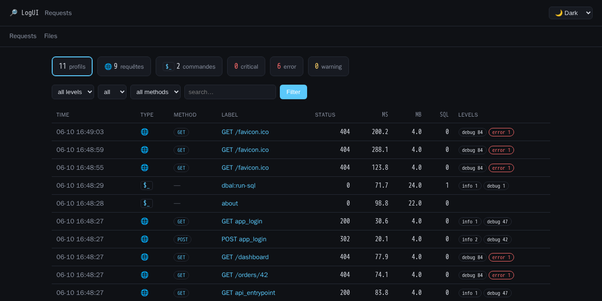

# 🔎 LogUI

> **Log viewer & lightweight profiler for Symfony.** It plugs into your existing logs — no separate store, no database, no build step. MIT licensed.

LogUI is an embeddable Composer package (in the spirit of Laravel Telescope / the Symfony Profiler)
that adds a small **web UI** to your app to browse requests, console commands and raw log files.

For every HTTP request and console command it captures pragmatic **stats** (duration, RAM
start→end→peak, SQL query count, log-level counts) plus the request's own log records, and appends it
all as **one `LOGUI@{json}` line to a telemetry log file**. The UI reads those lines back. It also
reads your **raw `.log` files** directly (Monolog, nginx access/error, …).

**No separate store. No new database. No front-end build.**


*The landing page: search box with an opt-in `regexp` mode, zoomable histogram stacked by level,
a fields panel built from what the query actually matched, and a live tail. Records are one dense
monospace line; click one to unfold every field.*


*Same view in the light theme. Three themes ship (dark / light / sepia), each with its own backdrop.*


*Request list: clickable stats, HTTP + console profiles, method / level / SQL columns, themes.*


*Request detail: timing, RAM start→peak, SQL count, and the request's own log records (filterable by level & channel).*


*Health tab (sepia theme): host cards (uptime, load, memory, aggregate disk usage — red over 85%) and the per-filesystem disks table.*

## Features

- Auto-capture: **HTTP requests**, **console commands**, **Monolog records** (level counts + the request's records), **uncaught exceptions**, **SQL queries** (count + slow, when `doctrine/dbal` is present).
- Pure-PHP stats (`memory_get_usage`/`peak` + a Doctrine middleware) — **no PHP extension required**.
- **Telemetry appended to a log file** (`LOGUI@` sentinel), read back by the UI — no database. Written **directly** (not through Monolog), so it works in prod regardless of `fingers_crossed`/`rotating_file` handlers. Reads are **tail-bounded** (multi-GB logs are fine).
- **Request detail** shows that request's log records (all channels, even ones your file handlers drop), filterable by level/channel.
- **Raw `.log` viewer** (Files tab): multi-format parser (Monolog line **and JSON** formatters, Symfony console logs, nginx access/error, ANSI-stripped) + auto-discovery of Monolog handler files + a scan of your log directories.
- **Log explorer** — *the landing page* (`/_logui`): a **search box**, a **zoomable time histogram** and a **live tail**, over **one file or all of them at once**.
  - **Search first**: type `payment failed` and get the lines that say so — **case-insensitive**, message *and* context, regex syntax treated as literal text. A **`regexp` checkbox** turns the same box into a pattern search when you want one. **Select any text in the logs** and a one-click *Grep* button offers to search for it.
  - **LogQL is opt-in**, folded behind a link under the search box: `{file="var/log/dev.log", level="error"} |= "payment" != "healthcheck" | json | status >= 500` — stream selector (`=`, `!=`, `=~`, `!~`), line filters (`|=`, `!=`, `|~`, `!~`), `| json`, and label filters (`| status >= 500`).
  - **Fields panel** (left): one collapsible group per field — `level`, `channel`, `file` — listing the values that actually occur with their counts and share of the matches. Tick to filter. Built from the current result set, not a hard-coded list, and ANDed with the query instead of rewriting it.
  - **Expandable records**: one dense monospace line each; click to unfold every field, with the context pretty-printed and syntax-highlighted. `expand all`, `wrap`, `clear` and a **row-count select** (50 → 1000, default 100) in the panel header. Expanding survives a refresh, including while tailing.
  - **Live starts clean**: pressing *Live* empties the list so the call you are about to make is the only thing on screen; leaving it reloads the window's history.
  - Histogram: bars stacked by level with per-level gradients, **drag to zoom**, click a bar to jump to it, double-click to zoom out, `←/→` to pan. KPI cards above it (records, errors, warnings, rate, query time).
  - Live tail: Server-Sent Events, **rotation-safe**, with automatic fallback to polling when a proxy blocks SSE. An arriving record **slides in tinted by its level** and washes the page in that colour — a burst of errors is visible without reading a line. Honours `prefers-reduced-motion`.
  - Ranged reads use a **binary search on byte offsets**: pulling one hour out of a 261 MB file takes **~120 ms instead of ~35 s**, reading 0.3 % of it — still no index, still no database.
  - Every query runs under a **wall-clock budget** (5 s) and a row cap; anything cut short comes back flagged `truncated` rather than tying up a worker.
  - The current query, window and filters live in the URL, so a view can be pasted to a colleague.
- **JSON-aware messages**: a message that is *text followed by JSON* is detected and the JSON is **pretty-printed, syntax-highlighted and collapsed to ~2 lines** with an expand/collapse toggle (client-side, in both the request detail records and the raw log viewer).
- **Dashboard UI**: clickable stats (general counts), method column, filters (level/type/method/search), pagination (100/page), and **dark / light / sepia** themes.
- **Health tab** *(read-only host metrics)*: uptime, load, memory, disks, network interfaces, **top processes** (`ps`), optional CPU temperature/throttle (Raspberry Pi), `vnstat` bandwidth, Docker containers and configured systemd services. Every probe **degrades gracefully** — anything unavailable on the host is simply not shown.
- **Security**: open in `dev`/`test`; in production it is **fail-closed** (password, or delegated to your firewall). Sensitive context keys are **redacted** before writing.

## Requirements

- PHP **8.2+**
- Symfony **6.4 / 7.x / 8.x** (HttpKernel, Console, HttpFoundation, Config, DependencyInjection, Routing, EventDispatcher)
- **TwigBundle** (the UI is rendered with Twig) — pulled in automatically
- Monolog **3**
- *(optional)* `doctrine/dbal` ^3.7|^4.0 — enables SQL query counting

## Install (Symfony)

LogUI ships a Flex recipe, so the quickest install is to point your app at this repo as a custom
recipe endpoint and require the package — the bundle, route and config are wired automatically, and
a random `LOGUI_PASSWORD` is generated into `.env` (override it in `.env.local` for production).

**1. Add the recipe endpoint** to your app's `composer.json`:

```json
{
    "extra": {
        "symfony": {
            "allow-contrib": true,
            "endpoint": [
                "https://raw.githubusercontent.com/aleblanc/logui/main/index.json",
                "flex://defaults"
            ]
        }
    }
}
```

**2. Require the package** — the recipe runs on install:

```bash
composer require aleblanc/logui
```

This auto-registers the bundle, creates `config/routes/log_ui.yaml` + `config/packages/log_ui.yaml`,
and writes a generated `LOGUI_PASSWORD` to `.env` (a default, like `APP_SECRET`; for production put a
real secret in `.env.local`, which isn't committed).

**Monolog capture is automatic** — the bundle wires its handler onto every channel for you (no
`monolog.yaml` edit). Disable it with `log_ui.capture_monolog: false` (e.g. in production); see
[Configuration](#configuration).

**Open the UI at `/_logui`** — the default path (configurable via `log_ui.ui_path`). It lands on the
**log explorer**; the captured requests are one tab over, at `/_logui/requests`. It's open in
`dev`/`test`; in `prod` it's fail-closed behind `LOGUI_PASSWORD` (or delegate to your firewall, see
[Access control](#access-control-in-production)).

> **Without the recipe** (or before tagging a release), do it by hand: add
> `Aleblanc\LogUi\Bridge\Symfony\LogUiBundle::class => ['all' => true]` to `config/bundles.php`,
> create `config/routes/log_ui.yaml` with `resource: '@LogUiBundle/config/routes.php'`, and set
> `LOGUI_PASSWORD` yourself. The bundle's config alias is **`log_ui`**. Monolog capture is still
> automatic. Recipe details & the `symfony/recipes-contrib` path: [`recipes/README.md`](recipes/README.md).

## Configuration

All keys are optional with sensible defaults (`config/packages/log_ui.yaml`):

```yaml
log_ui:
    telemetry_file: '%kernel.logs_dir%/%kernel.environment%.log'  # existing log to write/read telemetry
    slow_query_ms: 50                  # SQL slower than this is flagged
    max_records_per_profile: 1000      # cap on records captured per request (bounds line size)
    ui_path: /_logui
    access: password                   # password (default) | delegate
    ui_password: '%env(LOGUI_PASSWORD)%'  # required in prod when access=password
    ignore_paths: ['/_wdt', '/_profiler']  # never profiled (the UI path is always added)
    capture_monolog: true              # auto-wire the handler onto every Monolog channel
    discover_monolog: true             # auto-list files from Monolog handlers (Files tab)
    log_dirs: ['%kernel.logs_dir%']    # directories scanned for *.log (Files tab)
    external_logs: []                  # extra .log files to expose (outside the dirs above)
    redact_keys: [password, passwd, secret, token, authorization, api_key]
    health_services: []                # systemd units shown on the Health tab (e.g. [nginx, mariadb, php8.4-fpm])
```

### Access control in production

In `dev`/`test` the UI is open. In `prod` it is **fail-closed** — choose how to unlock it:

**`access: password`** (default) — serves nothing unless `LOGUI_PASSWORD` is set (the recipe
generates one in `.env`; put a **real, dedicated** secret in `.env.local` for production — never reuse
`APP_SECRET`). `ui_password` defaults to `%env(LOGUI_PASSWORD)%`, so it works out of the box. **Log in**
by sending that password on the request:

```bash
# HTTP header (preferred — doesn't end up in access logs)
curl -H "X-LogUI-Password: <your-password>" https://example.com/_logui

# or query string (browser)
https://example.com/_logui?_pw=<your-password>
```

On a successful login LogUI sets a **session cookie** (`logui_auth`, HttpOnly, SameSite=Lax, scoped
to `ui_path`, signed with an HMAC keyed on the password — the cookie never carries the password
itself). The token embeds a server-enforced 8 h expiry covered by the signature, so it cannot be
extended by tampering, and changing the password invalidates every outstanding token. You supply
`?_pw=` once; **navigation and the explorer's XHR calls then work without it**.

Two things worth knowing before you rely on `password` in production:

- **There is no rate limiting on the password.** LogUI keeps no store, so it has nowhere to count
  attempts. If the UI is reachable from the internet, put a limiter in front of it (nginx
  `limit_req`, your WAF) or use `delegate`.
- **A live tail holds one PHP worker** for up to 5 minutes per open tab (Server-Sent Events). On a
  small php-fpm pool, a handful of forgotten LogUI tabs can starve the application. Size the pool
  accordingly, or keep the UI off the public internet.

For a fully integrated production console (your own login, roles), `delegate` is still the cleaner
choice.

**`access: delegate`** (recommended in prod) — LogUI gates nothing and trusts your own security.
You log in with your normal app session, and navigation just works. Protect the route in
`security.yaml`:

```yaml
access_control:
    - { path: ^/_logui, roles: ROLE_ADMIN }
```

## Health tab

Read-only host metrics at `/_logui/health`. Every metric is gathered on demand and **degrades
gracefully**: when the source file/command is missing, that card or section is simply **not rendered**
(nothing to configure to "turn it off" on an unsupported host).

### Top cards

| Card | Shows | Source | Colour |
|---|---|---|---|
| **Host** | machine model (or OS family) | `/proc/cpuinfo` (`Model:`), else `PHP_OS_FAMILY` | — |
| **Uptime** | human uptime (`10j 20h 0min`) | `/proc/uptime` | — |
| **Temperature** | CPU temp (Raspberry Pi) | `vcgencmd measure_temp`, else `/sys/class/thermal/thermal_zone0/temp` | green <60 °C, amber <70 °C, red ≥70 °C |
| **Load (1/5/15 min)** | load averages + CPU count + bar | `/proc/loadavg`, `/proc/cpuinfo` | green; amber > 70% of cores; red > cores |
| **Memory** | used %, used/total + cache, bar | `/proc/meminfo` | green <70%, amber <85%, red ≥85% |
| **Disk** | aggregate used/size across all real filesystems, bar | sum of `df` | green <70%, amber <85%, **red ≥85%** |

### Sections

| Section | Shows | Source | Notes |
|---|---|---|---|
| **Power / Throttling** | under-voltage / frequency-capped / throttled / soft-temp flags (current + since-boot) | `vcgencmd get_throttled` | Raspberry Pi only; "OK" when clean |
| **Disks** | per-filesystem: mount, source, FS, used, size, usage % + bar | `df -B1 --output=source,fstype,size,used,avail,pcent,target` | skips `tmpfs`/`devtmpfs`/`overlay`/`udev`/`squashfs`; same green/amber/red thresholds |
| **Top processes** | up to **20** processes by CPU: PID, user, %CPU, %MEM, RSS, command | `ps -eo pid,user,pcpu,pmem,rss,comm --sort=-pcpu` | %CPU amber ≥40, red ≥80 |
| **Network interfaces** | name, state, IPv4 addresses, MAC | `ip -j addr show` | skips `lo`, `veth*`, `br-*` |
| **Network usage** | per-interface ↓rx / ↑tx / total, and current month *total → projected estimate* (+ % of month elapsed) | `vnstat --json` | hidden entirely when vnstat is absent |
| **Docker** | container, image, status, live **CPU%** and **memory (usage / limit)** | `docker ps -a` + `docker stats --no-stream` | CPU/memory shown only when `docker stats` succeeds |
| **Services** | configured systemd units with their state badge | `systemctl is-active <unit>` | only the units listed in `health_services` (empty ⇒ section hidden) |

Configure the monitored systemd units in `config/packages/log_ui.yaml`:

```yaml
log_ui:
    health_services: [nginx, mariadb, php8.4-fpm]
```

## How it works

A request-scoped holder is opened on `kernel.request`, fed log records by a Monolog handler and
exceptions by the kernel exception event, then finalized on `kernel.terminate`, which **appends a
single `LOGUI@{json}` line directly to `telemetry_file`** (not through Monolog — so it's immune to
`fingers_crossed` buffering and `rotating_file` naming, which otherwise swallow telemetry in prod).
Console commands are handled symmetrically via `ConsoleEvents`. The UI reads those lines back
(`TelemetryReader`, tail-bounded) and renders the dashboard with Core's filtering/sorting and
**Twig templates** (under `templates/logui/`, exposed as `@LogUi`). SQL counting is a DBAL middleware,
registered only when Doctrine DBAL is installed.

The telemetry file is a normal append-only log. Reads are tail-bounded, but the file itself grows
over time — **rotate it like any log** (logrotate, or point `telemetry_file` at a path your existing
rotation already covers).

## Architecture

A single package, layered: `Aleblanc\LogUi\Core\*` (framework-agnostic — zero Symfony/Monolog/Doctrine
imports, enforced by a custom PHPStan rule) and `Aleblanc\LogUi\Bridge\Symfony\*` (the bundle wiring).
The capture/storage/query Core stays framework-agnostic; the **UI is Symfony + Twig only for now** — a
future `logui-laravel` adapter would reuse the Core and ship its own (Blade) views.

## Roadmap

- Laravel adapter (the Core is already framework-agnostic).
- Publication on Packagist.

### Ideas under consideration

- **Pulse-style stats dashboard** (à la Laravel Pulse): aggregated cards over the telemetry —
  slowest requests/commands, busiest endpoints, error/exception rates, SQL hotspots, RAM peaks —
  computed from the existing `LOGUI@` lines, no new store.
- **Server health & system stats**: lightweight host metrics next to app telemetry —
  CPU/load, RAM, disk usage/inodes, uptime — read from `/proc` (or `sys_getloadavg()`), no agent.
- **Network usage via vnstat**: parse `vnstat --json` to show daily/monthly bandwidth per interface.
- **GoAccess integration**: surface a GoAccess HTML/JSON report from the parsed access logs
  (the Files tab already discovers nginx access/error logs) for top URLs, visitors, status codes.
- **MCP server**: expose LogUI telemetry to AI agents over the Model Context Protocol
  (query requests/commands/logs, fetch a profile, summarize errors) — read-only, reusing
  `TelemetryReader`.

## Development

```bash
composer install
composer test     # PHPUnit
composer stan     # PHPStan (level 8)
composer cs       # PHP-CS-Fixer (@Symfony)
```

## License

[MIT](LICENSE) © aleblanc
